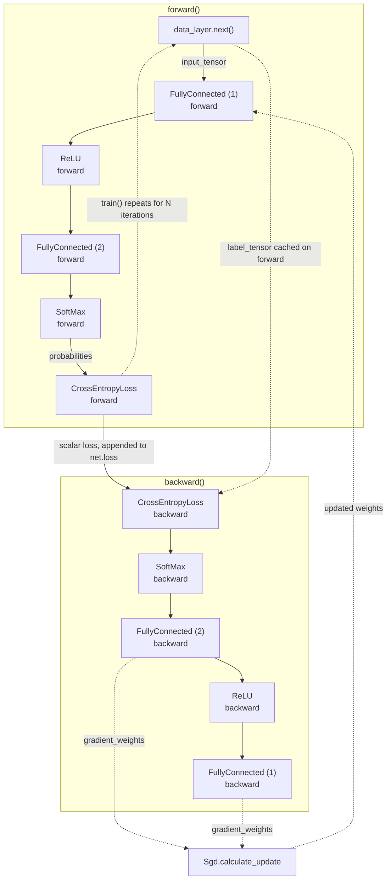

# FullyConnectedNeuralNetwork

A feed-forward neural network framework written from scratch in NumPy — layers, activations, loss and optimizer, with hand-derived backpropagation and no deep learning libraries.


Every gradient here is derived by hand and implemented directly. There is no autograd: each layer knows how to compute its own forward pass and how to turn an incoming error into the gradient for the layer beneath it.

---

## Part of a series

Four repositories building one NumPy deep learning framework, each extending the last:

1. [PatternGenDataHandler](https://github.com/husseinsaeid85-hue/PatternGenDataHandler) — pattern generation and image batch loading
2. **FullyConnectedNeuralNetwork** — the base framework: layers, loss, optimizer, training loop **(you are here)**
3. [NeuralNetFramework-CNN](https://github.com/husseinsaeid85-hue/NeuralNetFramework-CNN) — convolutional and pooling layers
4. [Regularization-RecurrentNN](https://github.com/husseinsaeid85-hue/Regularization-RecurrentNN) — regularization and recurrent layers

This repository defines the `BaseLayer` interface and the forward/backward contract that repositories 3 and 4 build on.

---

## What it implements

**Layers** (`Layers/`)

| Component | Description |
| --- | --- |
| `BaseLayer` | Shared interface. Holds the `trainable` flag and the `weights` slot; subclasses implement `forward` and `backward`. |
| `FullyConnected` | Affine layer. The bias is folded into the weight matrix by appending a column of ones to the input, so `weights` has shape `(input_size + 1, output_size)`. |
| `ReLU` | `max(0, x)`. Caches the forward input to mask the gradient where the input was non-positive. |
| `SoftMax` | Row-wise probability normalization, shifted by the row maximum for numerical stability. Its backward applies the Jacobian via `y * (e - sum(e * y))`, avoiding the full `k x k` matrix per sample. |
| `Helpers` | Development utilities: finite-difference gradient checking, plus Iris and random-noise data sources. |

**Optimization** (`Optimization/`)

| Component | Description |
| --- | --- |
| `CrossEntropyLoss` | Categorical cross-entropy for one-hot labels, summed over the batch. Expects probabilities, so it pairs with `SoftMax`. |
| `Sgd` | Stochastic gradient descent, `w <- w - lr * grad`. |

**Orchestrator** (`NeuralNetwork.py`)

`NeuralNetwork` ties the pieces together. It pulls batches from a `data_layer`, runs them through the layer stack into a `loss_layer`, drives the backward pass, and hands every trainable layer its **own deep copy** of the optimizer — so stateful optimizers added in later repositories never share state across layers.

---

## How forward and backward compose



Each layer caches whatever its backward pass needs during `forward` — `FullyConnected` keeps the bias-augmented input, `ReLU` keeps its input, `SoftMax` keeps its output. Trainable layers apply their weight update inside their own `backward`, so a single `backward()` call both propagates the error and steps the optimizer.

---

## Structure

```
FullyConnectedNeuralNetwork/
├── Layers/
│   ├── __init__.py
│   ├── Base.py             # BaseLayer: trainable flag, weights slot
│   ├── FullyConnected.py   # affine layer, bias folded into weights
│   ├── ReLU.py             # rectifier activation
│   ├── SoftMax.py          # probability normalization
│   └── Helpers.py          # gradient checking, Iris / random data sources
├── Optimization/
│   ├── __init__.py
│   ├── Loss.py             # CrossEntropyLoss
│   └── Optimizers.py       # Sgd
├── NeuralNetwork.py        # orchestrator: forward, backward, train, test
├── requirements.txt
├── LICENSE
└── README.md
```

---

## Install

```bash
git clone https://github.com/husseinsaeid85-hue/FullyConnectedNeuralNetwork.git
cd FullyConnectedNeuralNetwork
pip install -r requirements.txt
```

The framework itself needs only NumPy. `scikit-learn` is required solely by `Layers/Helpers.py`, which supplies the Iris dataset used below.

---

## Usage

Run from the repository root so that `Layers` and `Optimization` resolve as packages.

```python
import numpy as np

from NeuralNetwork import NeuralNetwork
from Layers.FullyConnected import FullyConnected
from Layers.ReLU import ReLU
from Layers.SoftMax import SoftMax
from Layers.Helpers import IrisData
from Optimization.Loss import CrossEntropyLoss
from Optimization.Optimizers import Sgd

# The optimizer is a prototype; each trainable layer receives a deep copy.
net = NeuralNetwork(Sgd(learning_rate=1e-3))

# A data layer is any object with next() -> (input_tensor, label_tensor).
net.data_layer = IrisData(batch_size=50)
net.loss_layer = CrossEntropyLoss()

# Iris: 4 input features, 3 classes.
net.append_layer(FullyConnected(4, 10))
net.append_layer(ReLU())
net.append_layer(FullyConnected(10, 3))
net.append_layer(SoftMax())

net.train(iterations=2000)

# net.loss holds one summed-over-batch loss value per iteration.
print(f"first: {net.loss[0]:.3f}   last: {net.loss[-1]:.3f}")

# test() is a forward pass only; it does not touch the loss layer.
x_test, y_test = net.data_layer.get_test_set()
probabilities = net.test(x_test)

accuracy = np.mean(np.argmax(probabilities, axis=1) == np.argmax(y_test, axis=1))
print(f"test accuracy: {accuracy:.3f}")
```

Swap `IrisData` for `RandomData(input_size, batch_size, categories)` to smoke-test shapes and the training loop against pure noise.

### Verifying gradients

`Layers/Helpers.py` checks the hand-derived gradients against finite differences. Both functions return a relative-difference array; entries near zero mean the analytical gradient is correct.

```python
from Layers.Helpers import gradient_check, gradient_check_weights

layers = [FullyConnected(4, 3), SoftMax(), CrossEntropyLoss()]
x, y = IrisData(batch_size=10).next()

print(gradient_check(layers, x, y).max())                 # w.r.t. the input
print(gradient_check_weights(layers, x, y, False).max())  # w.r.t. the weights
```

---

## Design notes

- **Explicit backward passes.** Every layer implements its own gradient. Reading `FullyConnected.backward` shows the full chain rule step, including why the bias column is dropped before the error is handed to the layer below.
- **Per-layer optimizer copies.** `append_layer` deep-copies the optimizer for each trainable layer. This is redundant for plain SGD but becomes necessary once momentum and Adam arrive in the later repositories.
- **Stable SoftMax.** Subtracting the row maximum before exponentiating is mathematically a no-op but prevents overflow on large logits.
- **Bias trick.** Rather than tracking a separate bias vector and its gradient, `FullyConnected` appends a constant column to the input, which keeps the forward and backward passes to a single matrix multiply each.

---

## License

MIT — see [LICENSE](LICENSE).
